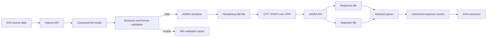

# AGIRA RA - API and Flat-File Integration Specification

## Document status

- **Purpose:** implementation-oriented English interpretation of the French *Guide Technique de Demarrage - Application RA, version 3.1*.
- **Target use:** implement a stateless translator that validates business JSON, serializes AGIRA RA messages, and parses inbound AGIRA files.
- **Authoritative source:** `RA_GuideTechniqueDeDemarrage.pdf` (25 pages, dated 2022 in the PDF metadata).
- **Local evidence reviewed:** the original campaign fixtures (now archived outside this package) and the focused regression tests under `../tests/`.
- **Important:** the PDF defines AGIRA RA, not an AXA-specific interface contract. AXA station identifiers, partner codes, transport endpoints, encryption, acknowledgements, retention rules, and any downstream AXA-only format must be confirmed separately.

This document distinguishes three kinds of statements:

- **Specified** - stated by the AGIRA guide.
- **Observed** - found in the local `.TXT` fixtures.
- **Recommended** - an implementation choice for the proposed API.

## 1. Executive summary

AGIRA RA is a French automobile-insurance termination registry. Participating insurers and brokers (the **Adherents**) send records when an automobile policy is terminated. They can also query the registry when underwriting a new policy, in order to compare an applicant's declarations with earlier policies, claims, and termination reasons.

There are four requester-to-AGIRA operations:

1. Create a termination record (`AGRESC`).
2. Modify an existing termination record (`AGRESM`).
3. Delete an existing termination record (`AGRESS`).
4. Query the registry (`AGQUES`).

AGIRA produces:

- query results (`AGREPO`);
- rejection details in `STR` segments for structurally or syntactically invalid messages.

The EDI payload is not CSV. A file has no header and contains one concatenated, fixed-width message per physical line. A message is made of ordered technical and functional segments. There are no field or segment separators. The `STM` segment declares the total message length.

For an AXA implementation, the safest mental model is:



The formatter should be a deterministic boundary component. Business services should operate on typed objects, never on character offsets.

The PDF standardizes the AGIRA-facing payload only. If the intended deliverable is a separate flat file sent **to AXA** after reading AGIRA data, keep that as a second adapter (`canonical RA model -> AXA flat file`). Do not reuse AGIRA offsets as an AXA contract unless AXA has explicitly adopted them.

## 2. What AGIRA RA does

### 2.1 Registry purpose

The RA application stores automobile policy-termination information supplied by participating insurers and brokers. It supports:

- creation, modification, and deletion of termination records;
- multi-criteria registry queries;
- responses even when a query has no match;
- rejections for invalid EDI messages;
- Extranet statistics and exchange tracking.

Only active records are visible to participating companies. Inactive records are retained for AGIRA/DARVA technical profiles. The guide also refers to CNIL-driven retention, purge, and rectification obligations but does not specify their detailed schedules.

### 2.2 Parties and responsibilities

| Party | Role |
|---|---|
| AGIRA | Association responsible for insurance-risk information services; RA is one of its sections. |
| GPSA | Operates people, logistics, and IT services for AGIRA and other insurance bodies. |
| DARVA | Hosts RA and concentrates file exchanges between AGIRA and participating insurers. |
| Adherent | Insurer or broker authorized to add, update, delete, and query RA data. In this design, AXA is treated as the Adherent/partner unless the actual topology says otherwise. |
| CNIL | French data-protection authority; the guide notes purge, retention, and rectification constraints. |

### 2.3 Environments

Production has two databases:

- a **real** database containing real data;
- a **test** database for onboarding and verification.

For EDI, the application code in the transfer/file identity selects the environment. For the Extranet, the URL selects it.

## 3. EDI operating model

### 3.1 Transport and schedule

**Specified:**

- transport is CFT-compatible file transfer using the PeSIT protocol over a secure VPN;
- onboarding requires a sender station number, sender/receiver application codes, and the RA server station number;
- the Adherent deposits one or more files before **22:00 on business day J**;
- AGIRA makes response/rejection files available from **05:00 on J+1**;
- a file may contain both update messages and query messages;
- an answer file is generated when at least one valid query was submitted, even when no registry record matches;
- a rejection-result file is generated when at least one query or update was submitted, even when no error was found;
- unanswered queries can be retried automatically by AGIRA; the EDI default is 90 days and is configurable per Adherent through AGIRA support.

The guide's wording calls the exchange asynchronous and batch-oriented. One sentence appears to reverse the two modes when describing unit versus bulk use; the rest of the guide and the diagrams clearly describe EDI as the bulk/asynchronous mode and the Extranet as the immediate/synchronous mode.

### 3.2 Application codes

These are the codes recommended in the guide. Exact directionality and station configuration must be agreed with DARVA.

| Database | Guide direction | Content | Application code |
|---|---|---|---|
| Real | Emission | Create, modify, delete, query | `HOCSFR42` |
| Real | Reception | Create, modify, delete, query result/rejection channel | `CSHRFR42` |
| Real | Reception | Query response messages | `CSHOFR42` |
| Test | Emission | Create, modify, delete, query | `HOCSFR43` |
| Test | Reception | Create, modify, delete, query result/rejection channel | `CSHRFR43` |
| Test | Reception | Query response messages | `CSHOFR43` |

### 3.3 Transfer filename

The guide defines this CFT naming template:

```text
{x_originator}-{x_ident}-{x_destination}-{x_sequence}-{x_local_ident}-{x_appli}-{x_yday}.{x_protocol}
```

| Component | Meaning |
|---|---|
| `x_originator` | Sender station |
| `x_ident` | Sender's transfer identifier |
| `x_destination` | Recipient station |
| `x_sequence` | Sequence number |
| `x_local_ident` | Internal transfer identifier |
| `x_appli` | Direction/content + RA application + environment code |
| `x_yday` | Day of year |
| `x_protocol` | Transfer protocol |

Guide example:

```text
AA790030-1715110-DARVA-6564-8486758-HOCSAR02-17.PHSE
```

The two local fixtures use a different wrapper-style name, for example `RA-AC000189-HOCSFR43.AC000189_202609020002.TXT`. Do not assume that wrapper convention is accepted by CFT without an AXA/DARVA agreement.

## 4. Physical flat-file contract

### 4.1 File framing

**Specified:**

- no file header;
- one message per physical line;
- maximum physical line length: **8,136 characters**;
- segments are concatenated with no separator;
- fields within a segment are concatenated with no separator;
- segment order and multiplicity depend on the message type.

**Observed in the local fixtures:**

- CRLF line endings;
- no byte-order mark;
- mostly ASCII, with one `0xC7` byte representing `Ç`, consistent with Windows-1252;
- in the 755-line creation fixture, every declared `STM` message length equals the number of bytes/characters on that line;
- maximum observed line length is 988, below the 8,136-character limit.

**Recommended:** make output encoding and newline explicit configuration. Use `windows-1252` and `CRLF` for the current profile because that is what the fixtures demonstrate, but obtain written confirmation from AXA/DARVA before production.

### 4.2 General field serialization

The guide gives type and maximum/fixed width but does not give a complete universal padding/character-normalization chapter. Use these rules as a proposed serializer profile until confirmed:

| Format | Proposed serialization |
|---|---|
| `AN(n)` | Normalize to the permitted partner character set, reject overflow, then right-pad with spaces to width `n`. Never silently truncate. |
| `N(n)` | Accept digits only and apply field-specific padding. Dates and identifiers already having an exact width are not reformatted. A genuinely optional absent field is represented according to the confirmed segment rule, normally spaces rather than zeroes. |
| Constant | Emit the exact literal shown in this document. |
| Date `JJMMAAAA` | Eight digits: day, month, four-digit year. Apply the partial-date exceptions stated for the specific field. |
| Timestamp `AAAAMMJJHHMMSS` | Fourteen digits. |
| Decimal CRM | Four characters in `9,99` form, using a comma. |
| Responsibility percentage | Three digits from `000` through `100`. |

Do not remove accents or replace characters until the allowed character set is confirmed. The local fixture proves that at least `Ç` may be emitted as Windows-1252, while AGIRA error `00008` explicitly rejects forbidden characters.

### 4.3 Message length

`STM.longueur_message` is the sum of every technical and functional segment actually present in that message, including the complete `STM` segment itself. It is encoded in five characters.

Recommended two-pass algorithm:

```text
1. Serialize every segment after STM.
2. Compute total_length = STM_WIDTH + sum(byte_length(segment)).
3. Build STM with total_length as exactly five digits.
4. Concatenate STM + all other segments.
5. Assert encoded_byte_length(message) == declared length.
6. Assert encoded_byte_length(message) <= 8136.
```

Because a single-byte legacy encoding is likely, character length and byte length are usually equal. The implementation must nevertheless validate encoded bytes, not Unicode code points.

## 5. Message catalogue and segment order

The order shown here is mandatory.

### 5.1 Create record - `AGRESC`

```text
STM, STE, 000, 001, 002{1..5}, 003, 004{0..10}, 005, 007{0..1}
```

- `000.identification_societe` may be blank on create. If supplied, AGIRA checks uniqueness.
- If blank, AGIRA assigns an identifier. The Adherent must query RA to recover it before later modification or deletion.
- `004` is required when termination reason is `3`; otherwise it is optional.
- `007` is present only after the insured person has exercised a rectification right.

### 5.2 Modify record - `AGRESM`

```text
STM, STE, 000, 001, 002{1..5}, 003, 004{0..10}, 005, 007{0..1}
```

`000.identification_societe` is mandatory and must identify the record created earlier.

### 5.3 Delete record - `AGRESS`

```text
STM, STE, 000
```

`000.identification_societe` is mandatory.

### 5.4 Query - `AGQUES`

```text
STM, STE, Q00, Q01
```

`Q01` contains search criteria. Although every criterion is individually marked optional, the API must require a meaningful supported criterion combination; otherwise the query is operationally useless and may be rejected.

### 5.5 Query result - `AGREPO`

```text
STM, STD, Q00, 006{1..8}, 000, 001, 002{1..5}, 003, 004{0..10}, 005, 007{0..1}
```

One `006` segment explains each match rule that caused the record to be returned.

For EDI answer files:

- the original question is placed on its own line;
- each matching result record is placed on the immediately following line;
- a question with no match still appears, with no result line below it;
- there is no file header.

The parser should therefore build groups of `question -> zero or more results`, rather than treating each line as an unrelated event.

### 5.6 Rejection line

```text
original question-or-update message + STR{0..5, while line length <= 8136}
```

The original submitted message is echoed even if no error was detected. Error segments follow it on the same line. AGIRA detects at most five errors, and any `STR` segment that would exceed the maximum line length is omitted. The full list remains available through the Extranet exchange-tracking view.

Observed AGIRA rejection files update `STM.longueur_message` to the complete physical response-line length, including appended `STR` segments. Inbound parsers should also tolerate legacy/local fixtures that preserve the original functional-message length and append `STR` beyond it.

## 6. Segment dictionary

`O` means mandatory and `F` means optional. Widths below are in characters as stated by the guide. "Nominal width" is the sum of the listed field widths; it is useful for offset calculations, but partner behavior around omitted trailing optional fields must be confirmed.

### 6.1 `STM` - message header

Nominal width: **42**.

| Field | Presence | Type | Width | Rule |
|---|---:|---:|---:|---|
| Segment code | O | AN | 3 | Constant `STM` |
| Message code | O | AN | 6 | `AGRESC`, `AGRESM`, `AGRESS`, `AGQUES`, or `AGREPO` |
| Message version | O | AN | 2 | Constant `00` |
| Message origin | O | AN | 1 | `T` teletransmission; `W` Extranet |
| Message length | O | AN | 5 | Total length of all segments in the message |
| Filler | F | N | 25 | Technical server area; outbound fixtures fill it with spaces |

### 6.2 `STE` - sender

Nominal width: **52**.

| Field | Presence | Type | Width | Rule |
|---|---:|---:|---:|---|
| Segment code | O | AN | 3 | Constant `STE` |
| Sender type | O | AN | 1 | Constant `C` |
| Sender | O | AN | 17 | The 14-character company code described below, completed with 3 spaces |
| - country code | O | N | 3 | Constant `250` |
| - company code | O | AN | 6 | Insurer: CCA code left-aligned; broker: last four digits of subscriber code |
| - internal company code | F | AN | 5 | Insurer: center discriminator; broker: CCA code of insurer for which the broker sends |
| Emission timestamp | F | N | 14 | `AAAAMMJJHHMMSS` |
| Emission mode | O | AN | 1 | Constant `T` for EDI |
| Sender message identifier | F | N | 16 | Guide says blank; server-use identifier |

### 6.3 `STD` - recipient

Nominal width: **36**.

| Field | Presence | Type | Width | Rule |
|---|---:|---:|---:|---|
| Segment code | O | AN | 3 | Constant `STD` |
| Recipient type | O | AN | 1 | Guide labels it "Type Emetteur" but functionally this is recipient type; constant `C` |
| Recipient | O | AN | 17 | Fourteen-character company code, completed with 3 spaces |
| Emission timestamp | F | N | 14 | `AAAAMMJJHHMMSS` |
| Emission mode | O | AN | 1 | Constant `T` for EDI |

### 6.4 `STR` - error

Nominal width: **41**; maximum five per message.

| Field | Presence | Type | Width | Rule |
|---|---:|---:|---:|---|
| Segment code | O | AN | 3 | Constant `STR` |
| Error code | O | AN | 5 | See section 8 |
| Segment in error | O | AN | 3 | Segment code concerned |
| Detail | F | AN | 30 | For relevant generic errors: functional-segment rank (3) + data code (4) + label (23) |

### 6.5 `000` - record identification

Nominal width: **57**.

| Field | Presence | Type | Width | Rule |
|---|---:|---:|---:|---|
| Segment code | O | AN | 3 | Constant `000` |
| Company identity | O | AN | 14 | Same 3 + 6 + 5 CLAN structure used by the sender |
| Company record identifier | Create: F; modify/delete: O | AN | 40 | Unique record identifier in the company; returned in responses |

### 6.6 `001` - contract

Nominal width: **49**.

| Field | Presence | Type | Width | Rule |
|---|---:|---:|---:|---|
| Segment code | O | AN | 3 | Constant `001` |
| Country code | O | N | 3 | Constant `250` |
| Company code | O | AN | 6 | Insurer's CCA code; for a broker, CCA of the insurer owning the contract; left-aligned |
| Internal company code | F | AN | 5 | Optional center discriminator |
| Contract number | O | AN | 20 | Policy/contract number |
| Effective date | O | AN | 8 | Entry date at the company, `JJMMAAAA` |
| Bonus/malus coefficient (CRM) | Conditional | AN | 4 | Format `9,99`; mandatory for vehicle category `0` or `2` |

### 6.7 `002` - subscriber or named driver

Nominal maximum width: **238**. One to five occurrences. At least one is required.

| Field | Presence | Type | Width | Rule |
|---|---:|---:|---:|---|
| Segment code | O | AN | 3 | Constant `002` |
| Person role | O | AN | 1 | `S` subscriber; `C` driver |
| Name or company name | Not marked in source table | AN | 20 | No civil title. Treat as required pending confirmation. |
| First name | F | AN | 12 | Normally blank for a legal entity |
| Legal-entity flag | O | AN | 1 | Space for natural person; `1` for legal entity |
| Birth date | Conditional | N | 8 | Natural person: mandatory; legal entity: optional. `DD=00` or `DDMM=0000` accepted; `00000000` also accepted for a legal entity. |
| Address line 1 | Address group O; line requirement unstated | AN | 32 | PTT postal standard |
| Address line 2 | Address group O; line requirement unstated | AN | 32 | PTT postal standard |
| Address line 3 | Address group O; line requirement unstated | AN | 32 | PTT postal standard |
| Address line 4 | Address group O; line requirement unstated | AN | 32 | PTT postal standard |
| Postal code | O | AN | 5 | At least first two characters present |
| City | O | AN | 26 | Required |
| SIREN | F | N | 9 | Optional, even for a legal entity |
| Licence-issue postal code | F | AN | 5 | At least first two characters when present |
| Driving-licence number | F | AN | 12 | Must be blank for a legal entity |
| Driving-licence date | F | N | 8 | `JJMMAAAA`; partial-date rules as for birth date; `00000000` also accepted for a legal entity |

### 6.8 `003` - termination

Nominal width: **12**.

| Field | Presence | Type | Width | Rule |
|---|---:|---:|---:|---|
| Segment code | O | AN | 3 | Constant `003` |
| Reason | O | AN | 1 | Code `1` through `5` below |
| Termination date | O | N | 8 | `JJMMAAAA` |

Termination reason codes:

| Code | Meaning |
|---|---|
| `1` | Insurer termination - contract nullity |
| `2` | Insurer termination - non-payment of premium |
| `3` | Insurer termination during the contract after a claim |
| `4` | Insurer termination at contract expiry |
| `5` | Insured termination or disappearance of the risk |

### 6.9 `004` - claim

Nominal width: **69**. Zero to ten occurrences. Required when `003.reason = 3`. Include claims from the previous five years; if there are more than ten, send the ten most recent.

| Field | Presence | Type | Width | Rule |
|---|---:|---:|---:|---|
| Segment code | O | AN | 3 | Constant `004` |
| Claim number | O | AN | 20 | Required |
| Claim nature | O | AN | 1 | `M` material; `C` bodily injury |
| Claim date | O | N | 8 | `JJMMAAAA`; `DD=00` accepted |
| Main guarantee | O | AN | 2 | Code below |
| Insured responsibility | O | N | 3 | `000` through `100` |
| Driver surname at claim time | F | AN | 20 | Optional |
| Driver first name at claim time | F | AN | 12 | Optional |

Guarantee codes:

| Code | Meaning |
|---|---|
| `01` | Third-party liability (`R.C.`) |
| `04` | Theft |
| `05` | Fire |
| `06` | Glass breakage |
| `07` | Damage |
| `99` | Other or undetermined |

### 6.10 `005` - vehicle

Nominal width: **33**.

| Field | Presence | Type | Width | Rule |
|---|---:|---:|---:|---|
| Segment code | O | AN | 3 | Constant `005` |
| Category | O | AN | 1 | Code below |
| Registration number | O | AN | 12 | Vehicle registration |
| Manufacturer code | F | AN | 3 | International vehicle identification component |
| Type/Mine | F | AN | 6 | International vehicle identification component |
| Serial number | F | AN | 8 | International vehicle identification component |

Vehicle category codes:

| Code | Meaning |
|---|---|
| `0` | Four wheels, under 3.5 tonnes |
| `1` | Four wheels, over 3.5 tonnes |
| `2` | Fewer than four wheels, 80 cm3 or more |
| `3` | Fewer than four wheels, under 80 cm3 |
| `4` | Taxi |
| `5` | Moped, under 49 cm3 |
| `6` | Motorcycle |
| `7` | Light quadricycle / voiturette |

### 6.11 `007` - CNIL rectification note

Nominal width: **163**. Present only when the insured person has used the right of rectification.

| Field | Presence | Type | Width | Rule |
|---|---:|---:|---:|---|
| Segment code | O | AN | 3 | Constant `007` |
| Text | O | AN | 160 | Comment recorded by AGIRA |

### 6.12 `Q00` - query identification

Nominal width from the PDF table: **69** (`3 + 14 + 40 + 12`). See the fixture discrepancy in section 11.

| Field | Presence | Type | Width | Rule |
|---|---:|---:|---:|---|
| Segment code | O | AN | 3 | Constant `Q00` |
| Country code | O | N | 3 | Constant `250` |
| Company code | O | AN | 6 | Insurer CCA left-aligned; broker's last four subscriber-code digits |
| Internal company code | F | AN | 5 | Insurer center code; for a broker, insurer CCA for the relevant contract |
| Company query identifier | O | AN | 40 | Caller-generated query correlation identifier |
| Server internal identifier | Source marks O | N | 12 | Returned by the server; outbound representation is not clearly specified |

### 6.13 `Q01` - query criteria

Nominal width: **123**.

| Field | Presence | Type | Width | Rule |
|---|---:|---:|---:|---|
| Segment code | O | AN | 3 | Constant `Q01` |
| Previous insurer company code | F | AN | 6 | Previous insurer CCA, left-aligned |
| Contract number | F | AN | 20 | Previous policy number |
| Name or company name | F | AN | 20 | Search criterion |
| Birth/maiden name | F | AN | 20 | Search criterion |
| First name | F | AN | 12 | Search criterion |
| Birth date | F | N | 8 | `JJMMAAAA` |
| Residence postal code | F | AN | 5 | Search criterion |
| Driving-licence date | F | N | 8 | Search criterion |
| Registration number | F | AN | 12 | Search criterion |
| SIREN | F | N | 9 | Search criterion |

### 6.14 `006` - match reason

Nominal width: **37**. One to eight occurrences in a result message.

| Field | Presence | Type | Width | Rule |
|---|---:|---:|---:|---|
| Segment code | O | AN | 3 | Constant `006` |
| Match code | O | AN | 2 | Code below |
| Match label | O | AN | 32 | Label below, padded to width |

| Code | Label | Match rule |
|---|---|---|
| `01` | `NOM+PRENOM` | Name + first name + same residence department |
| `02` | `PRECEDENT ASSUREUR` | Previous insurer company code + previous policy number |
| `03` | `NOM REDUIT+NAISSANCE` | First five name characters + birth date + same residence department |
| `04` | `NOM+NAISSANCE` | Name + birth month and year |
| `05` | `NOM+PRENOM+PERMIS` | Name + first name + driving-licence date |
| `06` | `NOM REDUIT+PERMIS` | First five name characters + licence date + same residence department |
| `07` | `IMMATRICULATION` | Registration number |
| `08` | `SIREN` | SIREN |

The PDF prints the third code as `3`, but the field width is two and all other codes are two digits; serialize it as `03` after partner confirmation. For department-based matching, all Ile-de-France departments are treated as one department.

## 7. Canonical translator interface

### 7.1 Design principles

The public interface exposes meaningful fields and ISO dates. The AGIRA adapter converts them to legacy representations.

- API dates: `YYYY-MM-DD` or an explicit partial-date object.
- EDI dates: `DDMMYYYY`.
- API decimals: JSON number or decimal string.
- EDI CRM: comma-formatted `9,99`.
- API absence: `null`/omitted field.
- EDI absence: partner-profile padding/omission rule.
- Enumerations: descriptive API values mapped centrally to AGIRA codes.
- Caller IDs: immutable correlation identifiers, unique within a question batch.

### 7.2 Implemented interfaces

```text
Python: json_to_agira(document) -> RenderedDocument
Python: agira_to_json(payload, source_filename, kind="raw") -> dict
CLI:    agira-translate to-agira BATCH.json
CLI:    agira-translate to-json FILE.TXT --kind raw
HTTP:   POST /v1/json-to-agira
HTTP:   POST /v1/agira-to-json?filename=FILE.TXT&kind=raw
```

All interfaces are stateless. Filesystem history, manifests, depot publication,
database access, and FTP transfer belong to the separate daily pipeline.

### 7.3 Example termination batch JSON

```json
{
  "environment": "test",
  "account_code": "AC000189",
  "sequence": 2,
  "emitted_at": "2026-09-18T23:00:00",
  "emitter": {
    "country_code": "250",
    "company_code": "0703",
    "internal_company_code": "ASUNI"
  },
  "records": [
    {
      "operation": "create",
      "company_record_id": "AXA-RA-2026-000001",
      "record_company": {"company_code": "0200"},
      "contract": {
        "insurer": {"company_code": "0200"},
        "contract_number": "POLICY-12345",
        "effective_date": "2025-10-21",
        "bonus_malus_coefficient": "1,12"
      },
      "persons": [
        {
          "role": "subscriber",
          "person_kind": "natural_person",
          "name_or_company_name": "DUPONT",
          "first_name": "ALICE",
          "birth_date": "1990-05-12",
          "address_lines": ["10 RUE EXEMPLE"],
          "postal_code": "75001",
          "city": "PARIS",
          "driving_licence_date": "2008-07-16"
        }
      ],
      "termination": {"reason_code": "5", "termination_date": "2026-09-03"},
      "claims": [],
      "vehicle": {"category_code": "0", "registration_number": "AB-123-CD"}
    }
  ]
}
```

The example values are illustrative and are not an AGIRA certification fixture.

### 7.4 Example question batch JSON

```json
{
  "environment": "test",
  "account_code": "AC000189",
  "sequence": 1,
  "emitter": {"company_code": "0703"},
  "questions": [
    {
      "query_id": "AXA-Q-2026-000001",
      "criteria": {
        "last_name_or_company_name": "DUPONT",
        "first_name": "ALICE",
        "birth_date": "1990-05-12",
        "residence_postal_code": "75001",
        "registration_number": "AB-123-CD"
      }
    }
  ]
}
```

## 8. Validation and AGIRA rejection mapping

### 8.1 Validation layers

Validate before serialization in this order:

1. **API schema:** types, required JSON properties, enum values.
2. **Business rules:** operation-specific identifiers, person/vehicle/claim conditions.
3. **EDI representability:** width, encoding, permitted characters, date representations.
4. **Message structure:** segment order and multiplicity.
5. **Rendered bytes:** declared length, maximum line length, newline and encoding.
6. **Batch rules:** environment, application code, filename, unique correlations, immutable manifest.

Never generate a production file containing a locally known validation error. Preserve rejected input and a redacted diagnostic event, but do not log full personal data in ordinary application logs.

### 8.2 Essential cross-field rules

- Modify/delete requires `companyRecordId`; create may omit it only if the recovery workflow is supported.
- One to five `002` persons.
- At least one subscriber should be required by the API, even though the guide only explicitly requires at least one `002` segment.
- Natural person: birth date required; legal-entity flag is a space in EDI.
- Legal entity: driving-licence number must be absent.
- Address group required; postal code and city required.
- Vehicle category `0` or `2`: CRM required.
- Termination reason `3`: at least one claim required.
- Maximum ten claims; choose the ten most recent when source data has more.
- Each responsibility percentage is `000..100`.
- Query identifiers are unique and stable.
- Query criteria must form at least one supported match family.

### 8.3 AGIRA error codes

| Code | Meaning |
|---|---|
| `00001` | Mandatory segment missing |
| `00002` | Mandatory data missing |
| `00003` | Non-numeric data in numeric field |
| `00004` | Invalid structure |
| `00005` | Invalid data |
| `00006` | Impossible value for the field |
| `00007` | Invalid date |
| `00008` | Forbidden character present |
| `AG001` | Unknown identification |
| `AG002` | Identification already exists |

For generic errors `00002` through `00007`, the 30-character detail is described as:

```text
functional-segment rank (3) + data code (4) + error label (23)
```

The functional-segment rank starts at the first functional segment, not at `STM`.

### 8.4 AGIRA data codes used in error details

| Code | Field | Code | Field |
|---|---|---|---|
| `0001` | Company identification | `0006` | Name/company name |
| `0009` | Licence date | `0011` | Effective date |
| `0012` | Claim date | `0013` | Legal-entity flag |
| `0017` | City | `0023` | Address line |
| `0024` | Termination date | `0025` | SIREN |
| `0026` | Termination reason | `0027` | Claim number |
| `0028` | Person type | `0036` | Claim nature |
| `0037` | Claim guarantee | `0038` | Vehicle category |
| `0039` | Match code | `0040` | Match label |
| `0041` | Responsibility percentage | `0042` | Bonus/malus coefficient |
| `0045` | Manufacturer code | `0046` | Type/Mine |
| `0047` | Serial number | `0050` | Company query identifier |
| `0052` | Server internal identifier | `0055` | Contract number |
| `0060` | Country code | `0066` | Company CCA code |
| `0067` | Internal company code | `0113` | Registration number |
| `0189` | Postal code | `0301` | First name |
| `0302` | Driving-licence number |  |  |

## 9. Serializer blueprint

### 9.1 Separate domain objects from EDI objects

Recommended modules:

```text
domain/
  records, persons, claims, vehicles, queries
validation/
  business rules, partner-profile rules, character rules
agira/
  codes, segment schemas, field encoders, message serializer, message parser
batches/
  grouping, filenames, manifests, hashes, idempotency
transport/
  CFT/PeSIT adapter and pickup workflow
inbound/
  response grouping, rejection parsing, correlation, AXA events
```

### 9.2 Schema-driven serializer

Define every segment once as ordered metadata:

```text
field name -> presence rule -> type -> width -> encoder -> validator
```

Then use the same schema to:

- serialize outbound segments;
- parse inbound segments;
- calculate offsets and message lengths;
- generate human-readable validation errors;
- generate unit-test cases.

### 9.3 Pseudocode

```text
function buildMessage(operation, canonicalData, profile):
    functionalSegments = mapOperationToSegments(operation, canonicalData, profile)
    validateOrderAndMultiplicity(operation, functionalSegments)

    technicalTail = buildSTE(canonicalData.emitter, profile)
    tail = technicalTail + concat(functionalSegments)

    totalBytes = STM_WIDTH + encodedByteLength(tail, profile.encoding)
    assert totalBytes <= 8136

    stm = buildSTM(
        messageCode = mapOperationCode(operation),
        version = "00",
        origin = "T",
        length = fiveDigits(totalBytes)
    )

    message = stm + tail
    assert encodedByteLength(message, profile.encoding) == totalBytes
    return encode(message, profile.encoding)
```

For inbound parsing, inspect `STM.message_code`, use the schema for that message type, and parse repeated segments by their three-character segment codes plus the expected order. Reject ambiguous or impossible layouts; do not scan blindly for strings such as `003`, because the same characters can occur inside business data.

## 10. Operational and security requirements

RA files contain personal data, policy identifiers, addresses, licence details, claims, and termination reasons. The implementation should therefore:

- encrypt data in transit and at rest;
- restrict access by environment and business role;
- keep test and real data strictly separated;
- redact PII from logs, traces, alerts, and support tickets;
- record immutable audit events for create/modify/delete/query/file actions;
- hash each produced and received file;
- make batch creation idempotent;
- prevent resending the same immutable batch accidentally;
- quarantine inbound files that fail encoding, framing, or length checks;
- retain data only according to an approved AXA/AGIRA/CNIL schedule;
- support rectification and deletion workflows without erasing required audit evidence improperly.

A useful manifest per output file is:

```json
{
  "batchId": "...",
  "environment": "test",
  "applicationCode": "HOCSFR43",
  "encoding": "windows-1252",
  "lineEnding": "CRLF",
  "messageCount": 755,
  "byteLength": 401906,
  "sha256": "...",
  "createdAt": "...",
  "sourceSnapshotId": "..."
}
```

## 11. Findings from the archived test fixtures

### 11.1 Large creation fixture

`RA-AC000189-HOCSFR43.AC000189_202609020002.TXT` contains:

- 755 physical lines;
- 755 `AGRESC` messages;
- a valid `STM` at byte 0 and `STE` at byte 42 on every line;
- declared length equal to physical message byte length on every line;
- CRLF after every line;
- line lengths ranging from 475 to 988;
- one Windows-1252 `Ç` byte and otherwise ASCII-compatible data.

It is useful for byte-level regression tests, but it contains records that appear inconsistent with the version 3.1 table - for example, some mandatory-looking segments/fields are shorter or shifted compared with nominal widths. It must not be promoted directly to a certification oracle. A validator should report those differences explicitly.

### 11.2 One-line functional fixture

`RA-AC000189-HOCSFR43.AC000189_202609070001.TXT` is 232 characters plus CRLF and contains:

```text
Q01 + Q00 + 006
```

It does **not** contain the mandatory `STM` and `STE`/`STD` technical segments required for a complete version 3.1 AGIRA message. It therefore looks like a derived/internal functional record rather than a complete CFT message.

It also places `006` at offset 195. With `Q01` at its documented width of 123, this makes the observed `Q00` area 72 characters, while the PDF's listed Q00 fields total 69. The extra three spaces may reflect an undocumented 17-character company-code convention, a local transformation, or a version difference. This must be resolved before implementing a certified inbound parser.

## 12. Open questions requiring AXA/DARVA confirmation

These are blockers for production certification, not for building the domain/API skeleton:

1. Is the integration direction AXA -> AGIRA, AGIRA -> AXA, or both?
2. What are AXA's CCA code, internal company/center code, CFT origin station, destination station, and PeSIT parameters?
3. Are the six guide application codes still current in 2026?
4. What exact filename convention does the current endpoint accept: the CFT guide pattern, the local wrapper pattern, or both?
5. Is the character encoding Windows-1252, ISO-8859-15, or another single-byte encoding?
6. Are line endings required to be CRLF?
7. What is the complete permitted-character repertoire and normalization policy?
8. Are optional fixed-width fields padded in place, or may trailing optional fields be physically omitted from a segment?
9. What must outbound `Q00.server_internal_identifier` contain - twelve spaces, zeroes, or another value?
10. Is `Q00` 69 or 72 characters in the currently deployed protocol?
11. Should match code 3 be serialized as `03`?
12. Is `002.name_or_company_name` formally mandatory, and which address line(s) must be populated?
13. Are acknowledgements/rejection files guaranteed even when no error exists, as the guide wording indicates?
14. What is the actual no-match response representation?
15. What are the retention, replay, duplicate-detection, rectification, and deletion obligations?
16. Are there newer AGIRA guides, field-code annexes, certified examples, or conformance tests?

## 13. Definition of done for the translator

The implementation is ready for partner certification when:

- every operation maps to the exact ordered segment sequence;
- all field widths, conditional rules, and multiplicities have automated tests;
- encoded byte length equals `STM.longueur_message` for every message;
- no line exceeds 8,136 encoded bytes;
- output has no header and uses the confirmed encoding/newline profile;
- filenames and application codes select the correct environment;
- create/modify/delete/query correlations are idempotent and auditable;
- inbound answer files group each question with zero or more results;
- inbound rejection lines preserve the original message and parse every available `STR`;
- malformed input is quarantined with a safe, redacted diagnostic;
- real personal data never enters the test environment;
- production output passes AXA/DARVA conformance tests and an end-to-end CFT test.

## 14. Source caveats

This interpretation preserves the guide's field tables and process rules while making inconsistencies explicit. The source itself contains apparent typographical or editorial issues, including the mode-description reversal, the one-digit printed match code `3`, duplicated annex subsection numbering for technical segments, and ambiguous presence rules in the `002` and `Q00` tables. Where this document proposes behavior, it labels that behavior as recommended or asks for partner confirmation rather than presenting it as an AGIRA fact.
